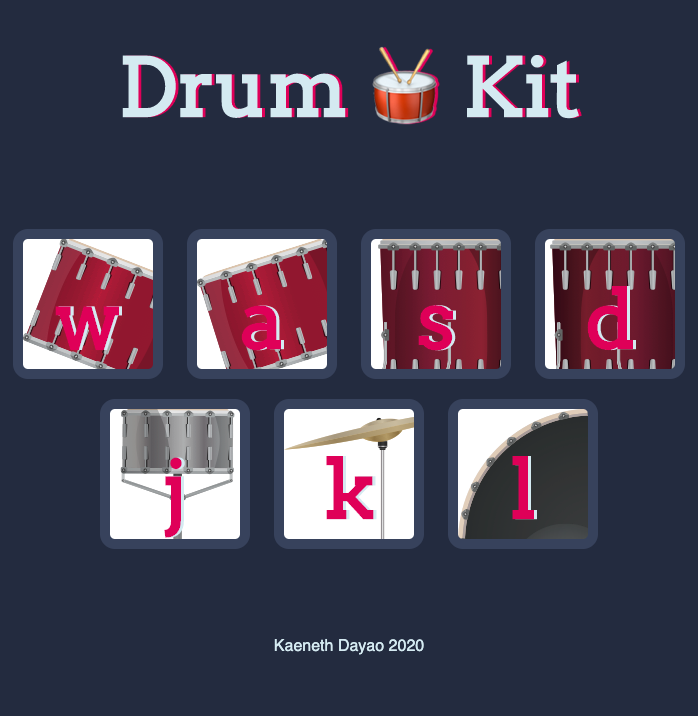

# Drumkit

## Description

This is a drumkit application. Play the drums using your mouse or your keyboard. This application is built using HTML, CSS, and Javascript.

## Table of Contents

* [Description](#description)
* [User Story](#user-story)
* [Installation](#installation)
* [Usage](#usage)
* [License](#license)
* [Contributing](#contributing)
* [Tests](#tests)
* [Questions](#questions)
* [Deployed Application URL](#deployed-application-URL)

## User Story

AS A drum musician
I WANT to be able practice my drums when on the go
SO THAT I can be prepared to perfrom in a concert.

## Installation

No installation needed

## Usage

The deployed application link will take you to the homepage. Use the mouse or the keyboard to play the specific drum sound.

## License

## Contributing

Please follow standard contributing guidelines.

## Tests

No tests to run.

## Questions

For any questions, please contact kendayao at kendayao@gmail.com

## Deployed Application URL

Deployed application link:  https://kendayao.github.io/Drumkit/

